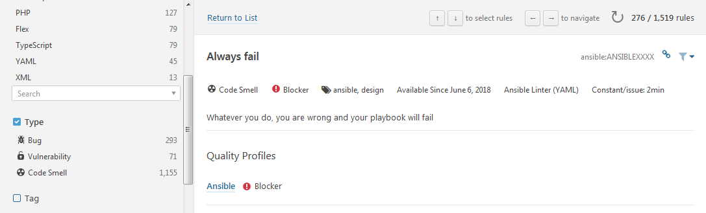

Ansible Lint Extension Plugin
=============================

The SonarQube plugin for Ansible was designed to easily add custom ansible-lint rules for non-Java developers. The intention is to allow Python developers to have their rules be added to SonarQube as easy as possible.

Due to technical constraints the chosen extension mechanism is based on a SonarQube plugin: you will add and package your custom rules into a new SonarQube plugin. However the plugin plumbing is hidden and creating such a new plugin should not be a big deal if you start from this `sonar-ansible-extras-plugin` project.

There are two ways to add lint rules and create the plugin: the regular one and the hacker's one. Choose the one you prefer (if you are not comfortable with Java, choose the hacker's way) but be aware that some restrictions apply to the hacker's way. In both cases there are some mandatory steps (writing your ansible-lint rule and some desriptor files) so let's start from that first.

**Be aware that we cannot be taken responsible for problems you might encounter with the custom rules you had to this plugin.**

## Common steps
1. Write your custom Python Ansible Lint rule. During so you have decided for an ID for your rule. Let's say this ID is `ruleID`. It will be used right hereafter to name some files.
2. Create 2 descriptor files for your rule as follows:
    1. Create a file `ruleID.json` as follows and customize:

            {
              "title": "Short title",
              "type": "CODE_SMELL",
              "status": "ready",
              "remediation": {
                "func": "Constant\/Issue",
              "constantCost": "2min"
              },
              "tags": [
                "ansible",
              "another_tag"
              ],
              "defaultSeverity": "Blocker"
            }

        The parameters are the following:

    | Parameter | Description |
    |------|------|
    | title | A short title for your rule. This title is likely to be the same the Python rule attribute `shortdesc`. |
    | type | One of: `CODE_SMELL`, `BUG`or `VULNERABILITY` |
    | constantCost | The time it is supposed to take to fix the issue; test and release |
    | tags | Any tag you find suitable for your rule. It is strongly recommended to have at least the "ansible" tag to ease the classification and search of the Ansible rules among the tones of other YAML rules. |
    | defaultSeverity | One of: `Info`, `Minor`, `Major`, `Critical` or `Blocker`. |

    2. Create a file `ruleID.html` that will contain the HTML fragment that will describe your rule in SonarQube's UI:

            
Playbooks shoulde not bla bla bla ...

        

## The regular way
### Restrictions
Although it is recommended to put together in a single plugin the rules that relate somewhat to each other, you can proceed below for as many plugins as you want. The only thing you have to pay attention to is the `artifactId` (see below) that must be unique.

### Requirements
On the build machine, you must have:

* Maven version 3.3.9 minimum
* Maven configured to download artifacts from Maven Central
* JDK 1.8

On SonarQube, you must have the [YAML SonarQube plugin](https://github.com/sbaudoin/sonar-yaml/) and the [Ansible SonarQube plugin](https://github.com/sbaudoin/sonar-ansible/) installed.

### Extension process

1. Create a new Maven project using the `pom.xml` file of this project as a template. Read the comments in this file to customize the plugin:
    * `groupId`: will depend on your organization. E.g.: com.mycompany
    * `artifactId`: technical identifier of the plugin within the groupId. It is strongly recommended to follow the SonarQube standard: `sonar-xxx-plugin`
    * `version`: version the plugin. You should increment the version every time you update the plugin.
    * Give a name and description to your plugin
    * Update or remove the `<ditributionManagement>` section
    * `sonar.pluginClass`: give there the complete name of your plugin class (see next step below)
2. Create the directory structure as follows:

        pom.ml         <== the file you jusst edited
        src
           /main
                /java
                     /...
                /resources
                          /extra-rules
                          /org
                              /sonar
                                    /l10n
                                         /ansible
                                                 /rules
                                                       /ansible-extras

    Under `src/main/java`, create subdirectories to reflect your `groupId` (e.g. `com/mycompany`)

3. Create the plugin class: in the `src/main/java/...` directory, create a class file (with camelcase: `MyClass.java`) with the following content:

            package com.mycompany;

            import org.sonar.plugins.ansible.extras.AbstractAnsibleExtrasPlugin;

            public class MyClass extends AbstractAnsibleExtrasPlugin {
            }

4. Put your Python rule in the directory `src/resources/extra-rules` and descriptor files in the directory `src/resources/org/sonar/l10n/ansible/rules/ansible-extras`
5. Compile the plugin:

        mvn package

    The compiled plugin will be locate in the `target` subdirectory.

6. Deploy the plugin in SonarQube (directory `extensions/plugins`) and restart

## The hacker's way
### Restrictions
The idea is to take the compiled plugin `sonar-ansible-extras-plugin` and hack the content of the JAR. The consequence is that you can do that only once per SonarQube instance: copying-pasting the JAR and renaming it does not work to have multiple plugins (OK, this is possible: you will have to edit the file `META-INF/MANIFEST.MF` to work this around but we let you try and learn how to proceed).

### Requirements
Have a ZIP utility to open and recreate the plugin JAR file. You may use the `jar` command line tool but be aware that you will have to handle the `MANIFEST.MF` file carefully.

On SonarQube, you must have the [YAML SonarQube plugin](https://github.com/sbaudoin/sonar-yaml/) and the [Ansible SonarQube plugin](https://github.com/sbaudoin/sonar-ansible/) installed.

### Extension process
Basically, you start the previous prcess at step 4:

1. Download [the extra plugin JAR file](https://github.com/sbaudoin/sonar-ansible/releases)
2. Open the file `sonar-ansible-extras-plugin-<version>.jar` with a ZIP tool
3. Put your Python rule in the directory `extra-rules` and descriptor files in the directory `org/sonar/l10n/ansible/rules/ansible-extras` of the JAR file
4. Save the JAR archive
5. Deploy the JAR in SonarQube (directory `extensions/plugins`) and restart
